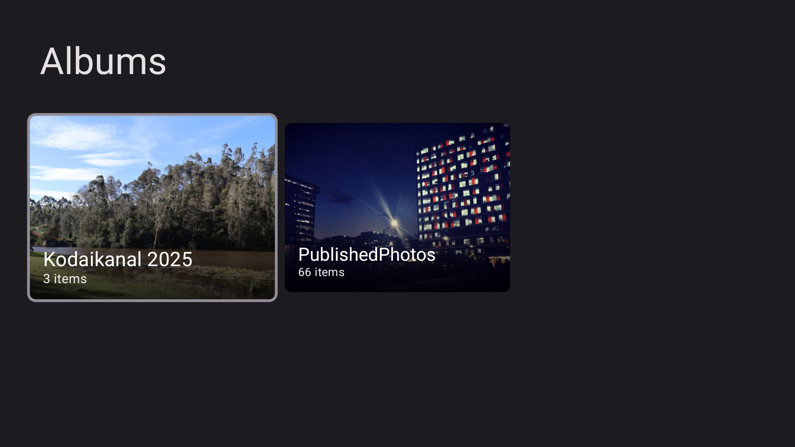
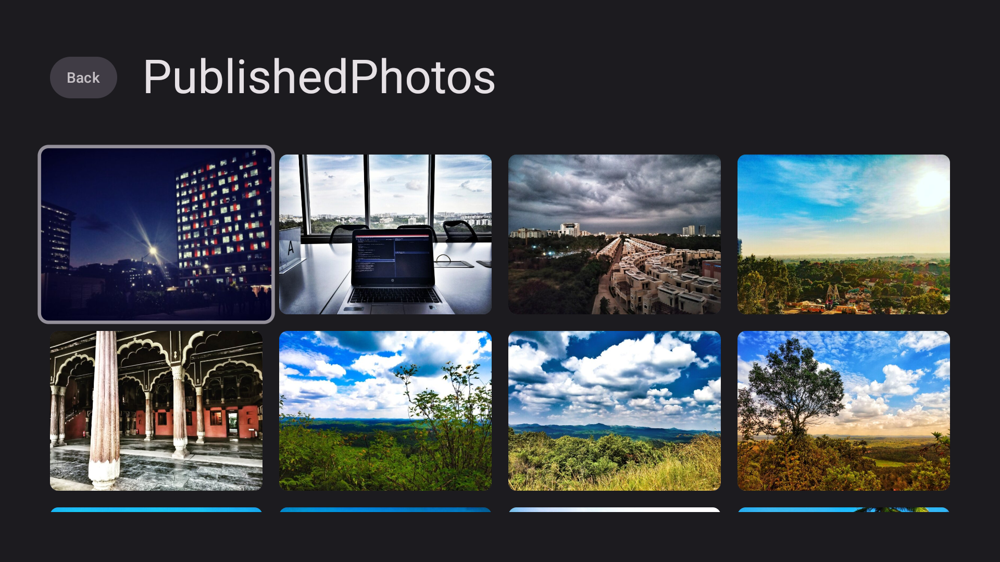
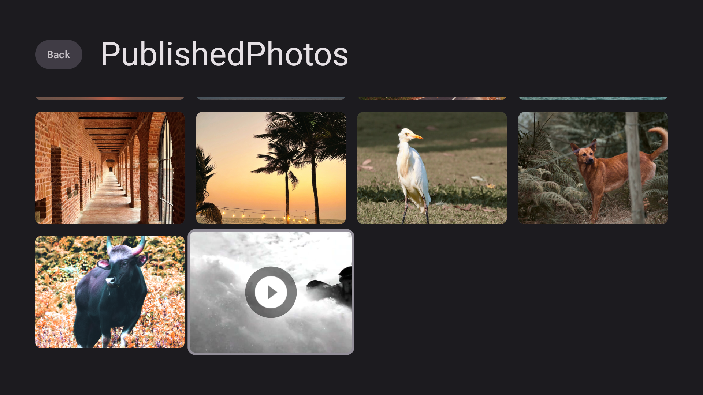
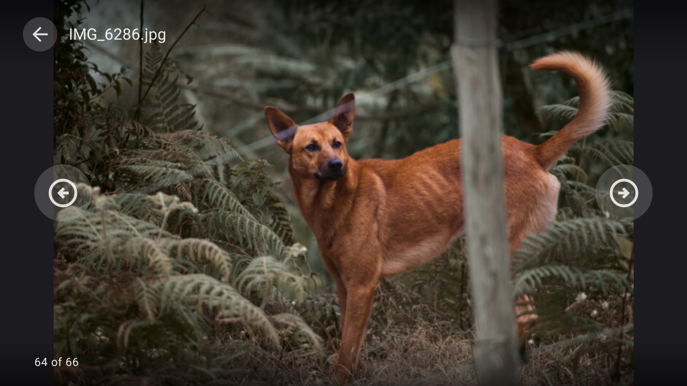
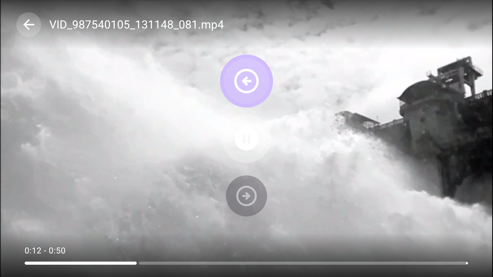

# Online Gallery

A gallery app for Android TV that streams your photos and videos directly from OneDrive. Each folder becomes an album — no uploads, no syncing, no extra storage.

> **Note**: This app was vibe-coded for personal use. Use at your own risk.

## Screenshots

  
  

  
  

  

## Features

- **Browse albums** — OneDrive folders appear as albums with cover thumbnails
- **Photo viewer** — Full-screen viewing with D-pad navigation between photos
- **Video playback** — Powered by VLC for broad codec support (MP4, MKV, AVI, WebM, MOV, etc.)
- **Resume playback** — Remembers where you paused a video
- **TV-first design** — Built with Jetpack Compose for TV and Leanback, optimized for remote control
- **Device Code Flow** — Sign in on your phone or computer, no typing passwords on your TV
- **Privacy-first** — Direct device-to-Microsoft communication, no intermediary servers, no client secrets

## Supported Formats

| Type | Formats |
|--------|---------|
| Images | JPEG, PNG, GIF, BMP, WebP, HEIC, HEIF |
| Videos | MP4, MKV, AVI, MOV, WebM, MPEG, 3GP |

## TV Remote Controls

**Photos**

| Button | Action |
|--------|--------|
| D-pad Left/Right | Previous / Next photo |
| Center | Toggle overlay |
| Back | Return to grid |

**Videos**

| Button | Action |
|--------|--------|
| D-pad Left/Right | Seek backward / forward 10s |
| D-pad Up/Down | Navigate to previous / next overlay button |
| Center | Toggle play / pause |
| Play/Pause | Toggle play / pause |
| Back | Return to grid |

## Getting Started

You'll need to register an app in the Azure Portal to get a Client ID for OneDrive access.

See **[SETUP.md](SETUP.md)** for full setup instructions, architecture details, troubleshooting, and configuration options.

## Security & Privacy

- **No server component** — the app talks directly to Microsoft Graph API
- **No client secrets** — uses OAuth 2.0 public client / Device Code Flow
- **Client ID** stored in `local.properties` (gitignored)
- **Tokens** stored locally in app-private SharedPreferences
- **All communication** over HTTPS

## License

This project was mostly vibe-coded using AI (Claude). The licensing of AI-generated code is still an evolving and unclear area, so this project is currently unlicensed. Use at your own discretion.
